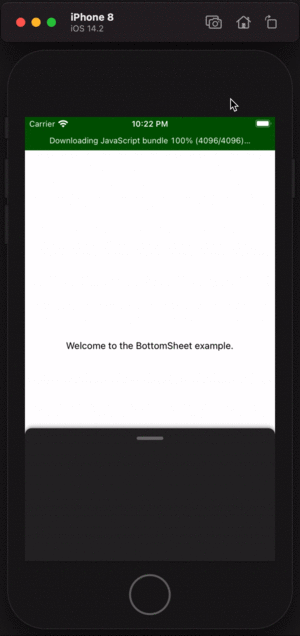

# react-native-reanimated-bottomsheet

A configurable and performant BottomSheet widget for React Native apps built using Reanimated v2 API.



## Installation

```sh
yarn add react-native-reanimated-bottomsheet
```

or

```sh
npm install react-native-reanimated-bottomsheet
```
### Dont forget to install Reanimated and GestureHandler libraries

```sh
yarn add react-native-reanimated
yarn add react-native-gesture-handler
```

or

```sh
npm install react-native-reanimated
npm install react-native-gesture-handler
```


### Add Reanimated's babel plugin to your `babel.config.js`
```js
 module.exports = {
      ...
      plugins: [
          ...
          'react-native-reanimated/plugin',
      ],
  };
```
* Note: Reanimated plugin has to be listed last.

### **Few extra miles for Android**

- Turn on Hermes engine by editing `android/app/build.gradle` (if you use Hermes)
    ```js
    project.ext.react = [
    enableHermes: true  // <- here | clean and rebuild if changing
    ]
    ```

- Plug Reanimated in MainApplication.java
    ```js
    import com.facebook.react.bridge.JSIModulePackage; // <- add
    import com.swmansion.reanimated.ReanimatedJSIModulePackage; // <- add
    ...
    private final ReactNativeHost mReactNativeHost = new ReactNativeHost(this) {
    ...

        @Override
        protected String getJSMainModuleName() {
            return "index";
        }

        @Override
        protected JSIModulePackage getJSIModulePackage() {
            return new ReanimatedJSIModulePackage(); // <- add
        }
        };
    ...
    ```

- Proguard

    If you're using Proguard, make sure to add rule preventing it from optimizing Turbomodule classes:

    `-keep class com.facebook.react.turbomodule.** { *; }`


#### Thats it! You are done with installation 🚀

<br>

## Usage

```js
import ReanimatedBottomsheet from "react-native-reanimated-bottomsheet";

 <ReanimatedBottomsheet
    snapPoints={[200, 400, 450]}
    renderContent={sheetContent}
    renderHeader={sheetHeader} />

```

## Props

| name                      | required | default | description |
| ------------------------- | -------- | ------- | ------------|
| snapPoints                | yes      |         | E.g. `[100, 200, 400]`. Points for snapping of bottom sheet coomponent. They define distance from bottom of the screen. Must be number to expect the height from bottom. Note: Array values must be in increasing order. |
| initialSnap               | no       |    0    | Determines initial snap point of bottom sheet. The value is the index from snapPoints. |
| renderContent             | yes       |         | Method for rendering scrollable content of bottom sheet. The container of the content should have `flex:1` to occupy dynamic height. |
| renderHeader              | yes       |         | Method for rendering non-scrollable header of bottom sheet. |
| enabledGestureInteraction | no       | `true`  | Defines if bottom sheet could be swipeable by gesture. |
| fixedHeight | no       | `false`  | Defines if bottom sheet only has one snap point with 0 being initial. This props is used in cases where the gestures are not required but the bottomsheet behaviour is expected. There are also imperative handlers provided to manually open and close the sheet for such cases. See below for those handlers. **For fixedHeight configuration, the 0th snapPoint would work as the top height of the sheet.** |
| springConfig | no       | `{damping: 50, mass: 0.5, stiffness: 121.6, restSpeedThreshold: 0.3}`  | Spring config for Bottom Sheet snap/open/close animation of type: `WithSpringConfig`|
----------------------------

<br>

## Methods

### `open()`

Imperative method on for snapping the sheet to 0th snap point. E.g.

```javascript
// Snap to the snap point at index 0 (e.g. 200 in [200, 300, 400])
this.bottomSheetRef.current.open();
```

### `snapTo(index: number)`

Imperative method on for snapping the sheet to a known index. E.g.

```javascript
this.bottomSheetRef.current.snapTo(index);
```

Here `this.bottomSheetRef` refers [to the `ref`](https://reactjs.org/docs/react-api.html#reactcreateref) passed to the `BottomSheet` component.
## Contributing

See the [contributing guide](CONTRIBUTING.md) to learn how to contribute to the repository and the development workflow.

## License

MIT
